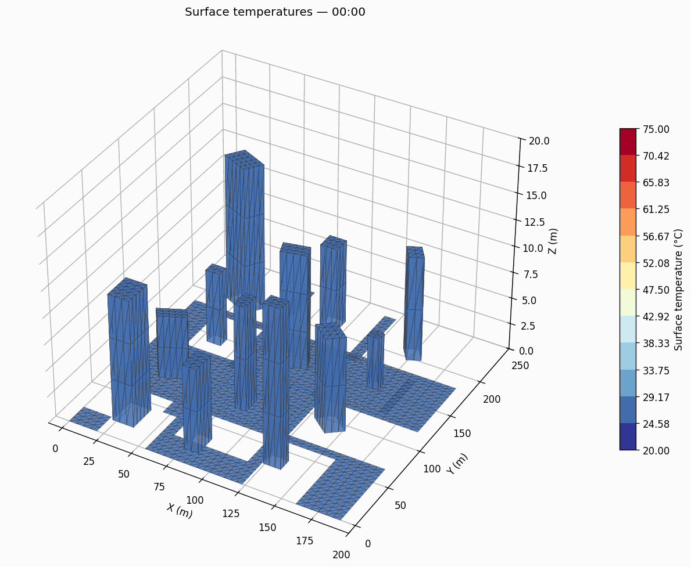
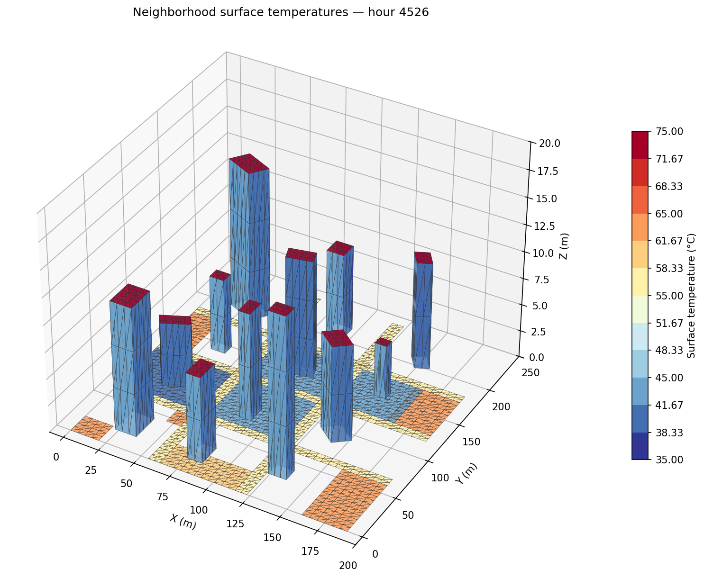
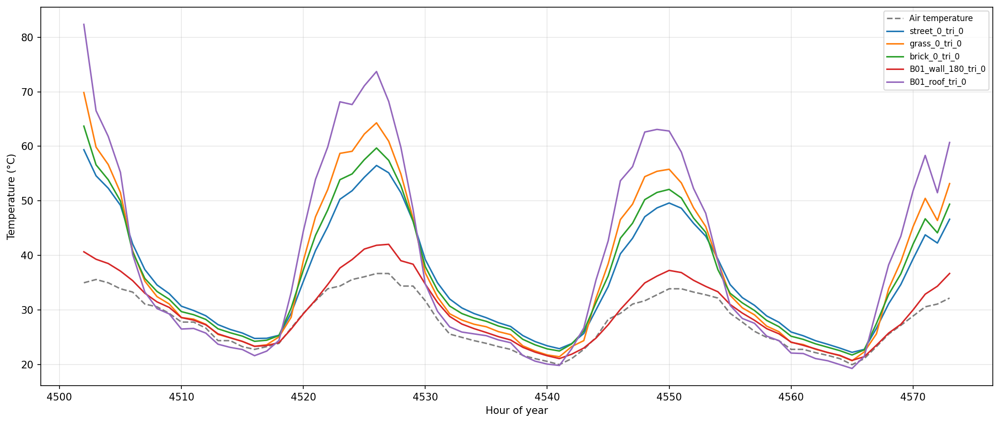
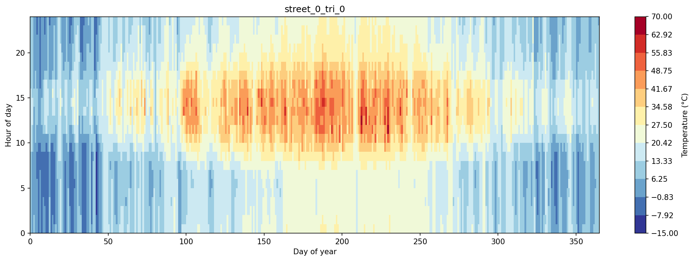

# SurfaceTemps

Frequency-domain admittance method for computing outdoor surface temperatures, based on [Beckett, Owens, and Acred (SimBuild 2026)](https://publications.ibpsa.org/conference/paper/?id=simbuild2026_1312).

The method decomposes the sol-air driving temperature into Fourier harmonics, applies a material-specific transfer matrix at each frequency, and reconstructs the surface temperature via inverse FFT. Geometry is read from STL facets, while the thermal solution remains a per-surface admittance calculation with no thermal mesh or warm-up period.

## Quickstart

```bash
uv pip install -e .
uv run python examples/neighborhood.py
```

This simulates a full year of hourly surface temperatures for a 12-building neighborhood in Atlanta and produces the figures shown below.

The default geometry is loaded from:

- `data/neighborhood_buildings.stl`
- `data/neighborhood_ground.stl`
- `data/neighborhood_surfaces.json`

## Method

### Sol-air temperature

The driving signal for each surface is the sol-air temperature, which combines convective, radiative, and solar heat transfer into a single equivalent temperature:

$$T_{\text{sol}} = \frac{h_c \, T_{\text{air}} + h_r \, T_{\text{sky}} + \alpha \, Q_{\text{sol}}}{h_c + h_r}$$

where $h_c$ is the convective coefficient (W/m²K), $h_r$ is the linearised radiative coefficient (W/m²K), $T_{\text{sky}}$ is the sky radiant temperature (K), $\alpha$ is the solar absorptivity, and $Q_{\text{sol}}$ is the incident solar irradiance (W/m²).

The convective coefficient follows the DOE-2 linear wind model:

$$h_c = 5.7 + 3.8 \, v_{\text{wind}}$$

Sky temperature is back-calculated from the EPW horizontal infrared radiation field:

$$T_{\text{sky}} = \left( \frac{E_{\text{IR}}}{\varepsilon \, \sigma} \right)^{1/4}$$

### Transfer matrix

Each material layer is characterised by a $2 \times 2$ complex transfer matrix at angular frequency $\omega = 2\pi / P$:

$$\mathbf{M}_{\text{layer}} = \begin{pmatrix} \cosh(pL) & \dfrac{\sinh(pL)}{\lambda \, p} \\ \lambda \, p \sinh(pL) & \cosh(pL) \end{pmatrix}$$

where $p = \sqrt{i\omega / \alpha_d}$, $\alpha_d = \lambda / (\rho c)$ is the thermal diffusivity, $L$ is the layer thickness, and $\lambda$ is the thermal conductivity. The matrix has the property $\det(\mathbf{M}) = 1$.

For a multi-layer assembly, the total transfer matrix is:

$$\mathbf{M}_{\text{total}} = \mathbf{M}_{si} \prod_{j=1}^{N} \mathbf{M}_j$$

where $\mathbf{M}_{si}$ is the internal surface resistance matrix and the product runs from the innermost to outermost layer. The external surface resistance $R_{so}$ is excluded from the matrix because it is applied as a boundary condition in the solver.

### Admittance solver

The sol-air temperature is decomposed into Fourier harmonics via FFT:

$$\widetilde{T}_{\text{sol}}(n) = \text{FFT}\left[ T_{\text{sol}}(t) - \bar{T}_{\text{sol}} \right]$$

At each harmonic $n$, the surface temperature transfer function is:

$$H_n = \frac{1}{1 + \dfrac{m_{1,n} \, R_{so}}{m_{2,n}}}$$

where $m_{1,n}$ and $m_{2,n}$ are the $(1,1)$ and $(1,2)$ entries of the total transfer matrix evaluated at the harmonic period $P/n$. The mean component is handled separately:

$$\bar{T}_{so} = \bar{T}_{\text{sol}} - U \left( \bar{T}_{\text{sol}} - T_i \right) R_{so}$$

where $U$ is the steady-state U-value. The fluctuating surface temperature is recovered by inverse FFT:

$$T_{so}(t) = \bar{T}_{so} + \text{IFFT}\left[ H_n \cdot \widetilde{T}_{\text{sol}}(n) \right]$$

Solar position and irradiance transposition are handled by [pvlib](https://pvlib-python.readthedocs.io/). Weather data comes from standard EPW files.

### STL geometry and occlusion

Building and ground facets are loaded from STL files and assigned assemblies, absorptivity, emissivity, and boundary conditions through `data/neighborhood_surfaces.json`.

Occlusion is handled in two places:

- Direct beam solar is blocked when the sun ray from a facet centroid intersects another STL triangle.
- Diffuse solar and longwave radiant temperature use pyViewFactor view factors with visibility and obstruction checks. Sky view is computed by complementarity against the modeled building and ground facets.

For the checked-in 5 m STL mesh, direct-shadow masks and pyViewFactor view factors are computed on each original rectangular parent surface and applied to its 5 m child triangles. This keeps the annual example practical while preserving the finer rendering and per-triangle thermal solve.

## Example output

### 24-hour cycle

Surface temperatures over a full diurnal cycle on the hottest day of the year in Atlanta. The animation loops continuously, showing how surfaces heat rapidly after sunrise, peak in the afternoon, and cool through the night.



### 3D neighborhood snapshot

Surface temperatures at the peak summer hour for a 12-building neighborhood in Atlanta. Buildings have brick walls and concrete roofs; ground surfaces include concrete streets, grass lawns, and brick courtyards.



### Time-series

Selected surface temperatures over 3 summer days compared to air temperature. Dark surfaces (roofs, $\alpha = 0.85$) show the largest diurnal swing and peak well above air temperature.



### Heatmap

Hour-of-day vs day-of-year heatmap for a concrete street surface ($\alpha = 0.65$). Peak temperatures occur in summer afternoons; nighttime temperatures track close to air temperature year-round.



## Default neighborhood

The example loads STL files generated from 12 box-shaped buildings of varying height (5--15 m), footprint, and rotation (0--60 deg), arranged on a ~200 m grid with concrete streets, grass lawns, and brick courtyards. Each STL triangle is simulated as its own surface. The checked-in default subdivides rectangular faces to a 5 m target panel size, for 956 building facets and 2,222 ground facets.

| Surface type | Material layers | $\alpha_{\text{sol}}$ |
|---|---|---|
| Concrete street | 1 m subsoil + 200 mm concrete | 0.65 |
| Brick paving | 1 m subsoil + 100 mm sand + 65 mm brick | 0.70 |
| Grass | 1 m subsoil + 300 mm topsoil + 50 mm sod | 0.75 |
| Brick wall | 13 mm plaster + 150 mm block + 25 mm air gap + 102 mm brick | 0.70 |
| Concrete roof | 13 mm plaster + 150 mm concrete + 35 mm insulation + 15 mm screed + 1 mm membrane | 0.85 |

## Project structure

```
surface_temps/
    constants.py        Material properties, physical constants
    materials.py        Layer and Assembly transfer matrix computation
    weather.py          EPW loading via pvlib
    solar.py            Sol-air temperature, sky temperature, irradiance transposition
    radiation.py        Direct sun obstruction and pyViewFactor sky/ground/building factors
    convection.py       Wind-dependent convective heat transfer coefficient
    admittance.py       Core FFT/IFFT solver
    geometry.py         STL/JSON geometry import plus procedural default generator source
    surfaces.py         Simulation orchestrator
    plotting.py         2D time-series, heatmaps, 3D neighborhood visualization
```

## Testing

```bash
uv run pytest
```

Tests verify transfer matrix determinant = 1, steady-state and sinusoidal response correctness, temperature bounds, orientation effects (south walls warmer than north), and absorptivity ordering.
They also verify STL loading, JSON mapping, view-factor sky obstruction, and lower temperatures for directly shaded surfaces.

## Dependencies

- numpy
- pvlib
- pandas
- matplotlib
- pyviewfactor
- pyvista
- numba
- tqdm

## Reference

Beckett, O., Owens, S., and Acred, A. (2026). "Applying Frequency Domain Methods for Calculating Outdoor Surface Temperatures." *Proceedings of the 12th National Conference of IBPSA-USA*, Minneapolis, MN.
